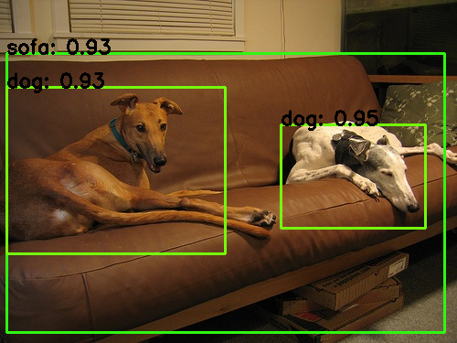

# De Monet - All of Object Detection

PyTorch training code and models reimplentation for object detection as described in [Liu et al. (2015), SSD: Single Shot MultiBox Detector](https://arxiv.org/abs/1512.02325). *Currently work in process, very pleasure for suggestion and cooperation.*



## About the code

- This repo borrows the architecture design and part of the code from [DETR](https://github.com/facebookresearch/detr).
- The implementation of `ssd_lite_mobilenet_v2` borrow the code from [pytorch-ssd](https://github.com/qfgaohao/pytorch-ssd).

# Usage
There are no extra compiled components in DEMONET and package dependencies are minimal, so the code is very simple to use. We provide instructions how to install dependencies via conda. First, clone the repository locally:
```
git clone https://github.com/vanillapi/demonet.git
```
Then, install PyTorch 1.5+ and torchvision 0.6+:
```
conda install -c pytorch pytorch torchvision
```
Install pycocotools (for evaluation on COCO) and scipy (for training):
```
conda install cython scipy
pip install -U 'git+https://github.com/cocodataset/cocoapi.git#subdirectory=PythonAPI'
```
That's it, should be good to train and evaluate detection models.


## Pretrained Models

We provide [`ssd_lite_mobilenet_v2`](https://drive.google.com/file/d/1kxHTaxABJJuwxNsB10eAxkGRqLUnGXtL/view) pretrained models, with map 0.684 on VOC2007 test subset (Training using VOC2007 and VOC2012 trainval subset).

```
AP for aeroplane = 0.6822
AP for bicycle = 0.7829
AP for bird = 0.6418
AP for boat = 0.5453
AP for bottle = 0.3479
AP for bus = 0.7876
AP for car = 0.7411
AP for cat = 0.8305
AP for chair = 0.5358
AP for cow = 0.6127
AP for diningtable = 0.7282
AP for dog = 0.7757
AP for horse = 0.8281
AP for motorbike = 0.8114
AP for person = 0.7201
AP for pottedplant = 0.4385
AP for sheep = 0.6250
AP for sofa = 0.7706
AP for train = 0.8191
AP for tvmonitor = 0.6545

Average Precision Across All Classes = 0.6839
```

## Data preparation

Support trainint with COCO and PASCAL VOC format (chosen with the parameter `--dataset-file [coco/voc]`). It's recommended to symlink the dataset root to `./data-bin`. With COCO format we expect the directory structure to be the following:

```
.
└── data-bin
    └── [data-path]
        ├── annotations
        └── images
```

When you are using PASCAL VOC format, we expect the directory structure to be the following:

```
.
└── data-bin
    └── [data-path]
        ├── VOC2007
        │   ├── Annotations
        │   ├── ImageSets
        │   └── JPEGImages
        └── VOC2012
            ├── Annotations
            ├── ImageSets
            └── JPEGImages
```

## Training

```
CUDA_VISIBLE_DEVICES=[GPU_ID] python -m train \
    --arch ssd_lite_mobilenet_v2 \
    --image-size 300 \
    --dataset-file voc \
    --train-set trainval \
    --val-set test \
    --dataset-year 2007 2012 \
    --data-path [DATA_PATH] \
    --output-dir [CHECKPOINT_PATH] \
    --epochs [NUM_EPOCHS] \
    --num-classes [NUM_CLASSES] \
    --batch-size 32 \
    --lr 0.01
```

## Evaluation

### Evaluation on voc dataset

```
CUDA_VISIBLE_DEVICES=[GPU_ID] python -m eval_voc \
    --arch ssd_lite_mobilenet_v2 \
    --image-size 300 \
    --dataset-file voc \
    --val-set test \
    --dataset-year 2007 \
    --data-path [VOC_DEVKIT_ROOT_PATH] \
    --num-classes [NUM_CLASSES] \
    --batch-size 32 \
    --resume [CHECKPOINT_PATH] \
    --output-dir [OUTPUT_DIR]
```

### Evaluation on coco dataset

```
CUDA_VISIBLE_DEVICES=[GPU_ID] python -m train \
    --arch ssd_lite_mobilenet_v2 \
    --image-size 300 \
    --dataset-file coco \
    --dataaset-mode pascal \
    --val-set test \
    --dataset-year 2007 \
    --data-path [DATA_PATH] \
    --resume [CHECKPOINT_PATH] \
    --num-classes [NUM_CLASSES] \
    --batch-size 32 \
    --test-only
```
